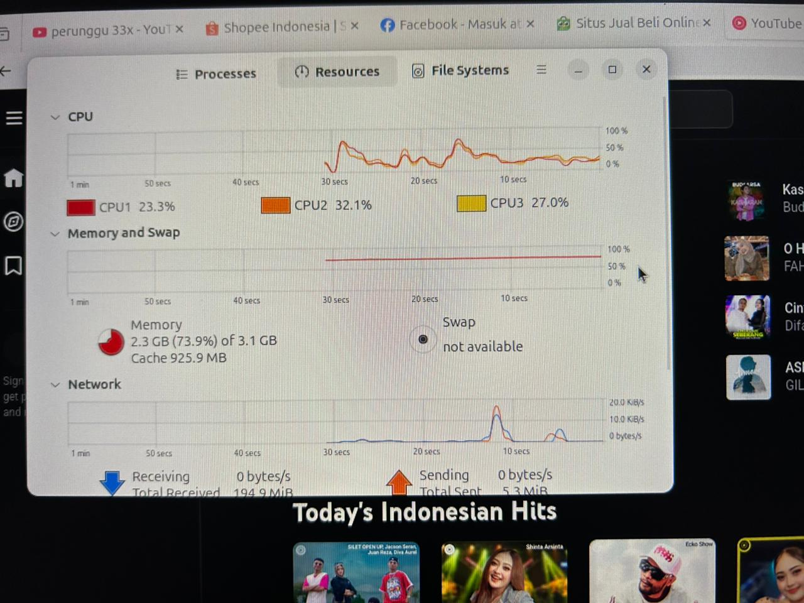

# Laporan Praktikum Minggu [12]
Topik: Virtualisasi Menggunakan Virtual Machine 

---

## Identitas
- **Nama**  : Hanif Arundaya Usman
- **NIM**   : 250202941
- **Kelas** : 1IKRB

---

## Tujuan
Tuliskan tujuan praktikum minggu ini.  
1. Menginstal perangkat lunak virtualisasi (VirtualBox/VMware).  
2. Membuat dan menjalankan sistem operasi guest di dalam VM.  
3. Mengatur konfigurasi resource VM (CPU, RAM, storage).  
4. Menjelaskan mekanisme proteksi OS melalui virtualisasi.  
5. Menyusun laporan praktikum instalasi dan konfigurasi VM secara sistematis.

---

## Dasar Teori
Tuliskan ringkasan teori (3–5 poin) yang mendasari percobaan.
1. Virtual Machine (VM) adalah lingkungan komputasi virtual yang meniru sistem komputer fisik dan dapat menjalankan sistem operasi secara mandiri.
2. Host OS adalah sistem operasi utama yang berjalan langsung di atas hardware fisik.
3. Guest OS adalah sistem operasi yang berjalan di dalam VM di atas host OS.
4. Hypervisor berfungsi sebagai pengelola resource hardware agar dapat dibagi ke beberapa VM secara terisolasi.
5. Virtualisasi meningkatkan efisiensi, isolasi, dan keamanan sistem dengan memisahkan lingkungan eksekusi tiap OS.
---

## Langkah Praktikum
A. Persiapan & Instalasi

- Mengunduh file ISO Ubuntu 24.04 Desktop dan aplikasi Oracle VirtualBox.
- Ubuntu 24.04 Desktop : https://ubuntu.com/download/desktop
- Oracle VirtualBox : https://download.virtualbox.org/virtualbox/7.2.4/VirtualBox-7.2.4-170995-Win.exe
Menginstal VirtualBox pada Dekstop (Host OS).

B. Konfigurasi Awal (High Resource)
1. Membuat Virtual Machine baru dengan nama Linux-Ubuntu.
2. Mengatur spesifikasi awal VM:
- RAM: 3096 MB (3 GB).
- CPU: 3 Core.
3. Menjalankan VM dan menunggu proses instalasi Ubuntu selesai hingga masuk ke desktop.

C. Eksperimen VM Linux Ubuntu 24.04 LTS

- Setelah Konfigurasi selesai, klik open untuk membuka Virtual Machine
Membuka Terminal dan menjalankan perintah dasar untuk mengecek spesifikasi sistem.
- Membuka aplikasi Firefox dan memutar video YouTube serta membuka 5 tab sekaligus untuk memberikan beban kerja (stress test).
- Membuka System Monitor untuk memantau grafik penggunaan RAM dan CPU saat beban tinggi.

D. Eksperimen VM Mengurangi Resource
1. Mematikan VM (Shutdown).
2. Masuk ke menu Settings > System di VirtualBox.
3. Menurunkan alokasi resource menjadi:
- RAM: 2048 MB (2 GB).
- CPU: 1 Core.
4. Menyalakan kembali VM dan mengulangi pengujian dengan membuka Firefox.
5. Mengamati terjadinya penurunan performa (lag) dan peningkatan penggunaan memori hingga mendekati batas maksimal.

---

## Kode / Perintah
Tuliskan potongan kode atau perintah utama:
- whoami untuk Mengecek user yang sedang aktif
- uname -a untuk Menampilkan informasi detail kernel dan arsitektur sistem
- ls untuk Menampilkan daftar file di direktori saat ini
- free -h Mengecek penggunaan Memori (RAM) 
```

```
## Hasil Eksekusi
## 1. Persiapan dan Instalasi
Proses menginstall Oracle Virtual Box untuk persiapan dalam pembuatan Virtual Machine.

## 2. Konfigurasi & Instalasi VM
Proses pembuatan mesin virtual menggunakan fitur Unattended Install di VirtualBox untuk otomatisasi instalasi Ubuntu.


3. Eksperimen VM Linux Ubuntu 24.04 LTS
Pengecekan spesifikasi menggunakan perintah uname -a (cek kernel) dan free -h (cek RAM).
Terlihat total RAM yang terbaca adalah 2.8Gi (3GB).


# 4.Pengujian beban kerja dengan membuka 5 tab Firefox (YouTube dan aplikasi belanja).


# 5. Stress Test (Skenario Low Resource : RAM 2 GB)
Setelah proses mengurangi Resource , kemudian membuka lagi VM dan membuka system manager, terlihat belum menjalankan aplikasi lain sudah memakan RAM 1.6 GB ( 76.7% ). 


### SKENARIO PENGUJIAN RESOURCE
-----------------------------------------------------
Skenario 1: Konfigurasi Normal (High Performance)
- Base Memory (RAM) : 3096 MB (3 GB)
- Processor (CPU)   : 3 Core
- Base Disk Memory  : 25 GB
- Video Memory      : 128 MB
- Hasil Test        : Lancar membuka 5 tab Firefox.

Skenario 2: Konfigurasi Rendah (Low Performance)
- Base Memory (RAM) : 2048 MB (2 GB)
- Processor (CPU)   : 1 Core
- Base Disk Memory  : 25 GB
- Hasil Test        : Terjadi lag signifikan, Firefox lambat merespons.


---
## Analisis
Virtual Machine menyediakan isolasi penuh antara host OS dan guest OS. Jika guest OS mengalami crash atau terinfeksi malware, host OS tetap aman. Hal ini serupa dengan konsep sandboxing, di mana setiap VM berjalan dalam lingkungan tertutup. Selain itu, virtualisasi juga mendukung hardening sistem karena setiap VM dapat dikonfigurasi secara terpisah sesuai kebutuhan keamanan.

---

## Kesimpulan
Tuliskan 2–3 poin kesimpulan dari praktikum ini.
1. Virtualisasi memungkinkan menjalankan beberapa sistem operasi pada satu perangkat fisik.
2. Konfigurasi resource VM sangat berpengaruh terhadap performa guest OS.
3. Virtual Machine meningkatkan keamanan melalui isolasi sistem dan proteksi OS.
---


---
## Quiz
1. Apa perbedaan antara host OS dan guest OS?
Host OS berjalan langsung di atas hardware fisik, sedangkan guest OS berjalan di dalam mesin virtual di atas host OS.
2. Apa peran hypervisor dalam virtualisasi?
Hypervisor bertugas mengelola dan membagi resource hardware (CPU, RAM, storage) ke setiap VM secara aman dan terisolasi.
3. Mengapa virtualisasi meningkatkan keamanan sistem?
Karena setiap VM terisolasi, sehingga gangguan atau serangan pada satu VM tidak memengaruhi sistem lain atau host OS.
---

## Refleksi Diri
Tuliskan secara singkat:
- Apa bagian yang paling menantang minggu ini?  
laptop lagi lagi sering kepakai
- Bagaimana cara Anda mengatasinya?  
menunggu dengan sabar
---

**Credit:**  
_Template laporan praktikum Sistem Operasi (SO-202501) – Universitas Putra Bangsa_
