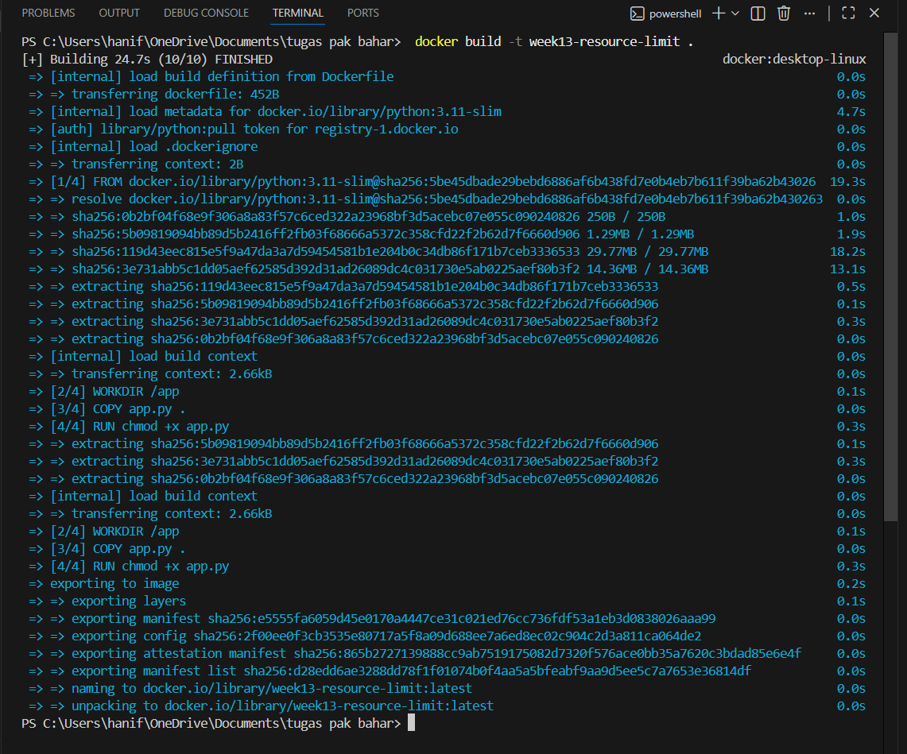
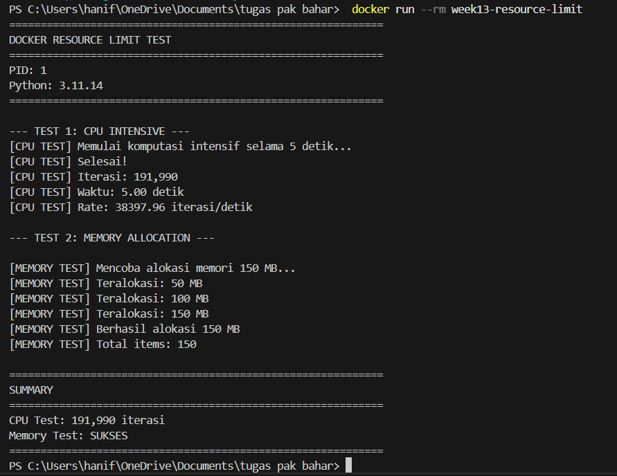
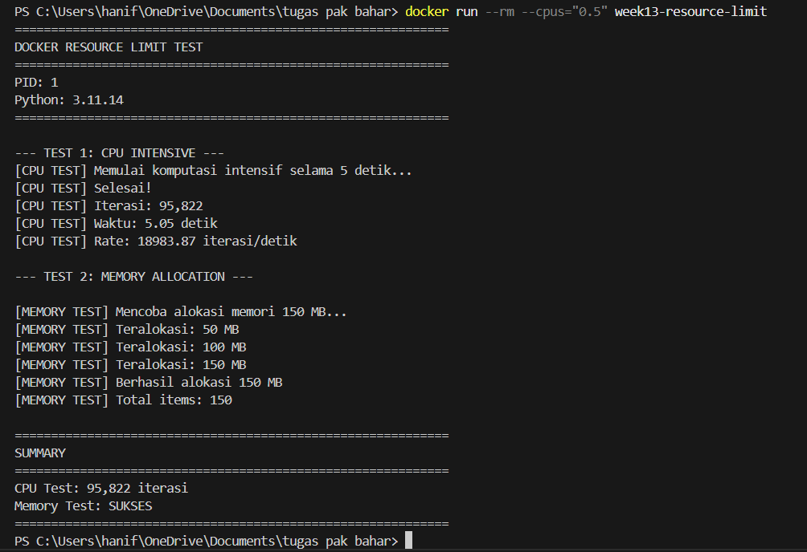
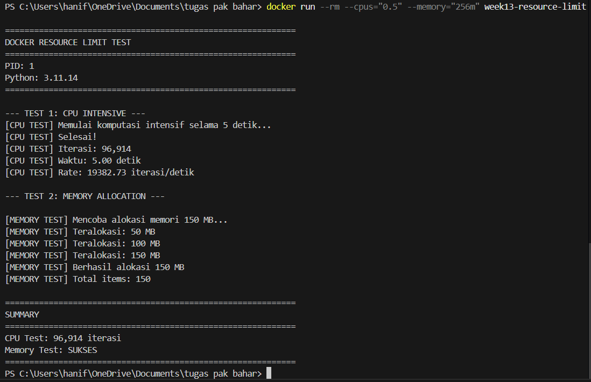

# Laporan Praktikum Minggu [13]
Topik: Docker – Resource Limit (CPU & Memori)

---

## Identitas
- **Nama**  : Hanif Arundaya Usman
- **NIM**   : 250202941
- **Kelas** : 1IKRB

---

## Tujuan
Tuliskan tujuan praktikum minggu ini.  
Contoh:  
> Mahasiswa mampu menjelaskan fungsi utama sistem operasi dan peran kernel serta system call.
1. Menulis Dockerfile sederhana untuk sebuah aplikasi/skrip.
2. Membangun image dan menjalankan container.
3. Menjalankan container dengan pembatasan **CPU** dan **memori**.
4. Mengamati dan menjelaskan perbedaan eksekusi container dengan dan tanpa limit resource.
5. Menyusun laporan praktikum secara runtut dan sistematis.

---

## Dasar Teori
Tuliskan ringkasan teori (3–5 poin) yang mendasari percobaan.
1. Containerization
Container adalah teknologi virtualisasi tingkat OS yang memungkinkan aplikasi berjalan terisolasi dengan berbagi kernel sistem operasi host.
2. Control Groups (cgroups)
Linux menggunakan cgroups untuk membatasi, mengatur, dan memonitor penggunaan resource seperti CPU, memori, dan I/O pada proses atau container.
3. Namespace
Namespace memberikan isolasi antar container sehingga setiap container memiliki ruang proses, jaringan, dan sistem file sendiri.
4. CPU Resource Limiting
Docker dapat membatasi penggunaan CPU container menggunakan parameter seperti --cpus, sehingga container tidak dapat menggunakan CPU melebihi batas yang ditentukan.
5. Memory Resource Limiting
Pembatasan memori (--memory) mencegah container menggunakan RAM secara berlebihan; jika batas terlampaui, container dapat dihentikan otomatis (out of memory).
---

## Langkah Praktikum
1. **Persiapan Lingkungan**
   - Pastikan Docker terpasang dan berjalan.
   - Verifikasi:
     ```bash
     docker version
     docker ps
     ```
2. **Membuat Aplikasi/Skrip Uji**
   Buat program sederhana di folder `code/` (bahasa bebas) yang:
   - Melakukan komputasi berulang (untuk mengamati limit CPU), dan/atau
   - Mengalokasikan memori bertahap (untuk mengamati limit memori).
3. **Membuat Dockerfile**
   - Tulis `Dockerfile` untuk menjalankan program uji.
   - Build image:
     ```bash
     docker build -t week13-resource-limit .
     ```
4. **Menjalankan Container Tanpa Limit**
   - Jalankan container normal:
     ```bash
     docker run --rm week13-resource-limit
     ```
   - Catat output/hasil pengamatan.
5. **Menjalankan Container Dengan Limit Resource**
   Jalankan container dengan batasan resource (contoh):
   ```bash
   docker run --rm --cpus="0.5" --memory="256m" week13-resource-limit
   ```
   Catat perubahan perilaku program (mis. lebih lambat, error saat memori tidak cukup, dll.).
6. **Monitoring Sederhana**

   - Jalankan container (tanpa `--rm` jika perlu) dan amati penggunaan resource:
     ```bash
     docker stats
     ```
   - Ambil screenshot output eksekusi dan/atau `docker stats`.


---

## Kode / Perintah
### 1. Isi file Docker
```bash

FROM python:3.11-slim

WORKDIR /app

COPY app.py .

CMD ["python", "app.py"]

```
### 2. isi file python (app.py)
```python
import time

data = []
i = 0

print("Program mulai...")
try:
    while True:
        # Komputasi CPU
        for _ in range(10_000_000):
            i += 1

        # Alokasi memori bertahap
        data.append("A" * 10_000_000)  # ~10 MB
        print(f"Iterasi ke-{len(data)}, penggunaan memori bertambah")
        time.sleep(0.5)

except MemoryError:
    print("MemoryError: Memori tidak cukup!")
```


---
### 1. Command Docker
1. Command untuk proses Build Image
```
 docker build -t week13-resource-limit .
```
2. Command untuk menjalankan container tanpa resource limit.
```
 docker run --rm week13-resource-limit
 ```
3. Command untuk proses menjalankan container dengan cpu limit.
```
docker run --rm --cpus="0.5" week13-resource-limit
```
4. command untukproses menjalankan container dengan memory limit.
```
docker run --rm --memory="128m" week13-resource-limit
```
5. command untukproses menjalankan container dengan cpu dan memory limit.
```
docker run --rm --cpus="0.5" --memory="256m" week13-resource-limit
```
---

## Hasil Eksekusi
### Build docker image

### 1.container tanpa limit

### 2. Container dengan CPU Limit (0.5 CPU)

### 3. Container dengan Memory Limit

### 4. Container dengan CPU & Memory Limit


### Monitoring dengan docker stats
```bash
# Terminal 1: Jalankan container (tanpa --rm agar bisa dimonitor)
docker run --name test-resource --cpus="0.5" --memory="256m" week13-resource-limit

# Terminal 2: Monitor
docker stats test-resource
```

---

## Analisis
Pembatasan CPU menyebabkan proses komputasi berjalan lebih lambat karena jatah waktu eksekusi dikurangi. Pembatasan memori menyebabkan aplikasi yang terus mengalokasikan memori akan dihentikan oleh sistem saat melebihi batas yang ditentukan. 

---

## Kesimpulan
Tuliskan 2–3 poin kesimpulan dari praktikum ini.
1. Docker mendukung pembatasan CPU dan memori menggunakan cgroups.
2. Limit resource berpengaruh langsung terhadap performa aplikasi.
4. Pembatasan resource penting untuk efisiensi dan stabilitas sistem.
---

## Quiz
### 1. Mengapa container perlu dibatasi CPU dan memori?
Agar satu container tidak menghabiskan seluruh resource host dan mengganggu container lain.

### 2. Apa perbedaan VM dan container dalam konteks isolasi resource?
VM menggunakan virtualisasi hardware penuh, sedangkan container berbagi kernel OS dengan isolasi melalui cgroups dan namespaces.

### 3. Apa dampak limit memori terhadap aplikasi yang boros memori?
Aplikasi dapat melambat, crash, atau dihentikan otomatis oleh sistem.
---

## Refleksi Diri
Tuliskan secara singkat:
- Apa bagian yang paling menantang minggu ini?  
lumayan bingung 
- Bagaimana cara Anda mengatasinya?  
dicoba terus menerus
---

**Credit:**  
_Template laporan praktikum Sistem Operasi (SO-202501) – Universitas Putra Bangsa_
