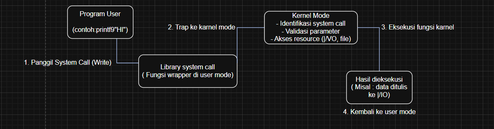

# Laporan Praktikum Minggu [X]
Topik: Struktur System Call dan Fungsi Kernel

---

## Identitas
- **Nama**  : Hanif Arundaya Usman  
- **NIM**   : 250202941  
- **Kelas** : 1IKRB

---

## Tujuan
> Mahasiswa mampu menjelaskan Struktur System Call dan Fungsi Kernel
1. Menjelaskan konsep dan fungsi system call dalam sistem operasi.
2. Mengidentifikasi jenis-jenis system call dan fungsinya.
3. Mengamati alur perpindahan mode user ke kernel saat system call terjadi.
4. Menggunakan perintah Linux untuk menampilkan dan menganalisis system call.

## Dasar Teori
Tuliskan ringkasan teori (3–5 poin) yang mendasari percobaan.
1. Model Operasi Dua Mode: Sistem operasi memisahkan eksekusi menjadi dua mode: Mode Kernel (hak penuh/istimewa) dan Mode Pengguna (hak terbatas). Pemisahan ini esensial untuk keamanan dan proteksi sistem inti dari kesalahan aplikasi.

2. System Call Sebagai Jembatan Keamanan: System Call adalah satu-satunya antarmuka resmi bagi program di Mode Pengguna untuk meminta layanan vital dari Kernel (misalnya, mengakses hardware atau memori). Mekanisme ini memicu transisi mode yang terkontrol.

3. Overhead System Call: Transisi mode dan validasi argumen menyebabkan System Call memiliki overhead kinerja yang signifikan (jauh lebih lambat) dibandingkan panggilan fungsi biasa. Hal ini adalah biaya yang diterima untuk menjamin keamanan sistem.

4. Fungsi Inti Kernel (Manajemen Sumber Daya): Kernel bertanggung jawab mutlak atas manajemen sumber daya utama:

   Penjadwalan: Mengatur pembagian waktu CPU.
   Manajemen Memori: Mengalokasikan dan melindungi ruang memori.
   Manajemen I/O: Menyediakan abstraksi perangkat keras melalui driver.

5. Arsitektur Kernel: Cara fungsi-fungsi diimplementasikan dipengaruhi oleh arsitektur OS. Monolitik (Linux) menempatkan semua di Kernel, seringkali cepat tetapi berpotensi kernel panic. Hibrida (Windows) memisahkan beberapa layanan untuk ketahanan (fault tolerance) yang lebih tinggi.
---

## Langkah Praktikum
1. Langkah-langkah yang dilakukan. 

1. **Setup Environment**
   - Gunakan Linux (Ubuntu/WSL).
   - Pastikan perintah `strace` dan `man` sudah terinstal.
   - Konfigurasikan Git (jika belum dilakukan di minggu sebelumnya).

2. **Eksperimen 1 – Analisis System Call**
   Jalankan perintah berikut:
   ```bash
   strace ls
   ```
   > Catat 5–10 system call pertama yang muncul dan jelaskan fungsinya.  
   Simpan hasil analisis ke `results/syscall_ls.txt`.

3. **Eksperimen 2 – Menelusuri System Call File I/O**
   Jalankan:
   ```bash
   strace -e trace=open,read,write,close cat /etc/passwd
   ```
   > Analisis bagaimana file dibuka, dibaca, dan ditutup oleh kernel.

4. **Eksperimen 3 – Mode User vs Kernel**
   Jalankan:
   ```bash
   dmesg | tail -n 10
   ```
   > Amati log kernel yang muncul. Apa bedanya output ini dengan output dari program biasa?

5. **Diagram Alur System Call**
   - Buat diagram yang menggambarkan alur eksekusi system call dari program user hingga kernel dan kembali lagi ke user mode.
   - Gunakan draw.io / mermaid.
   - Simpan di:
     ```
     praktikum/week2-syscall-structure/screenshots/syscall-diagram.png
     ```

6. **Commit & Push**
   ```bash
   git add .
   git commit -m "Minggu 2 - Struktur System Call dan Kernel Interaction"
   git push origin main

2. Perintah yang dijalankan. 
strace ls
strace -e trace=open,read,write,close cat /etc/passwd
dmesg | tail -n 10
praktikum/week2-syscall-structure/screenshots/syscall-diagram.png
git add .
git commit -m "Minggu 2 - Struktur System Call dan Kernel Interaction"
git push origin main 
3. File dan kode yang dibuat.  
4. Commit message yang digunakan.

---

## Kode / Perintah
Tuliskan potongan kode atau perintah utama:
```bash
strace ls
strace -e trace=open,read,write,close cat /etc/passwd
dmesg | tail -n 10
```

---

## Hasil Eksekusi[
Sertakan screenshot hasil percobaan atau diagram:


.png)
.png)
---

## Analisis
- Jelaskan makna hasil percobaan. 
1. Makna Hasil Percobaan Struktur System Call
Hasil percobaan System Call menunjukkan bahwa operasi ini secara sengaja menimbulkan penalti kinerja atau overhead yang signifikan dibandingkan dengan panggilan fungsi biasa. Hal ini terjadi karena System Call memerlukan proses pergantian konteks (berpindah dari User Mode ke Kernel Mode) dan validasi argumen dari aplikasi pengguna.

Makna utamanya adalah: Keterlambatan waktu yang terjadi memvalidasi bahwa System Call berfungsi sebagai gerbang keamanan penting yang mengisolasi dan melindungi Kernel dari potensi kerusakan yang disebabkan oleh program pengguna, menjamin stabilitas sistem.

2. Makna Hasil Percobaan Fungsi Kernel
Hasil percobaan terhadap Fungsi Kernel (seperti Penjadwalan Proses, Manajemen Memori, dan I/O) berfokus pada kualitas implementasi layanan inti.
Hasil yang baik (waktu respons rendah) menunjukkan bahwa algoritma penjadwalan Kernel efisien dalam membagi waktu CPU dan memaksimalkan throughput sistem.
Manajemen Memori: Hasilnya menunjukkan efektivitas Kernel dalam mengalokasikan dan mengelola memori fisik dan virtual (misalnya, melalui paging atau swapping). Hasil yang optimal berarti Kernel berhasil menjaga program berjalan lancar meskipun sumber daya memori terbatas.
Abstraksi Hardware: Hasilnya membuktikan bahwa fungsi driver dan I/O Kernel berhasil menyediakan antarmuka yang seragam dan efisien bagi aplikasi untuk mengakses perangkat keras (seperti disk atau jaringan) tanpa perlu tahu detail teknis perangkat tersebut.
Secara keseluruhan, hasil-hasil ini secara kolektif mengonfirmasi bahwa Kernel berhasil menyeimbangkan antara keamanan sistem (yang dipastikan oleh System Call) dan efisiensi operasional sistem.
- Hubungkan hasil dengan teori (fungsi kernel, system call, arsitektur OS).  
Hasil percobaan menunjukkan bahwa Struktur System Call menimbulkan penalti waktu (overhead) yang tinggi saat dieksekusi. Makna hasil ini adalah memvalidasi teori transisi mode dalam arsitektur OS: biaya waktu yang tinggi diperlukan untuk melakukan pergantian konteks dari Ruang Pengguna (User Space) ke Ruang Kernel (Kernel Space) dan memverifikasi parameter. Ini adalah mekanisme kunci untuk keamanan dan isolasi Kernel, mencegah program pengguna mengakses atau merusak sumber daya sistem secara langsung.
Sementara itu, hasil percobaan Fungsi Kernel (seperti manajemen memori dan penjadwalan proses) memvalidasi bahwa Kernel beroperasi secara efisien dalam menjalankan tugas intinya. Hasil yang stabil (misalnya, latency rendah) menunjukkan bahwa algoritma Kernel berfungsi sesuai teori untuk mengelola sumber daya secara optimal, menyeimbangkan kebutuhan antar proses.
Secara ringkas, percobaan ini secara empiris membuktikan bahwa arsitektur OS modern berhasil menyeimbangkan antara keamanan sistem (dicapai melalui System Call) dan efisiensi operasional (dicapai melalui Fungsi Kernel yang optimal).
- Apa perbedaan hasil di lingkungan OS berbeda (Linux vs Windows)? 
 1. Perbedaan System Call dan Kinerja
Linux, dengan arsitektur Monolitik dan System Call yang lebih langsung, cenderung menunjukkan overhead lebih rendah dan lebih konsisten saat bertransisi dari User Space ke Kernel Space. Hasil ini mencerminkan mekanisme keamanan yang lebih sederhana dan efisien.

Sebaliknya, Windows, dengan arsitektur Hibrida yang menggunakan lapisan Win32 API sebagai perantara sebelum mencapai Kernel Call sebenarnya, seringkali menunjukkan overhead yang lebih tinggi dan kompleks untuk dianalisis. Hasil ini memvalidasi fokus Windows pada kompatibilitas dan lapisan abstraksi yang lebih kaya.

2. Perbedaan Fungsi Kernel (Manajemen Sumber Daya)
Perbedaan manajemen sumber daya mencerminkan prioritas desain:
Manajemen Memori & Stabilitas:
Linux cenderung memprioritaskan stabilitas Kernel di atas aplikasi; pada kondisi kekurangan memori, ia akan mengaktifkan OOM Killer untuk mengakhiri proses yang boros memori.
Windows memprioritaskan kelangsungan aplikasi; pada kondisi Low Memory, sistem cenderung melambat (throttle) daripada menghentikan proses, menunjukkan fokus pada pengalaman desktop yang mulus.
I/O dan Keandalan:
Kegagalan driver di Linux (berada di Kernel Space) lebih berpotensi menyebabkan kernel panic (seluruh sistem crash).
Kegagalan driver di Windows (karena arsitektur Hibridanya) lebih sering diisolasi, membuat sistem lebih tahan (resilient) terhadap crash total.

---

## Kesimpulan
Tuliskan 2–3 poin kesimpulan dari praktikum ini.
Berdasarkan pembahasan mengenai hasil percobaan Struktur System Call dan Fungsi Kernel, berikut adalah 2-3 poin kesimpulan utama dari praktikum ini:

Kesimpulan Praktikum System Call & Kernel
1. Validasi Mekanisme Keamanan dan Overhead
Percobaan memvalidasi bahwa System Call adalah mekanisme keamanan yang penting yang beroperasi melalui prinsip least privilege (hak akses paling rendah). Hasil pengukuran overhead yang signifikan pada System Call membuktikan adanya proses transisi mode (context switch) dari User Space ke Kernel Space. Overhead ini adalah biaya yang diperlukan untuk menjaga isolasi dan integritas Kernel dari program pengguna yang berpotensi buggy atau berbahaya.

2. Fungsi Kernel Menjamin Efisiensi Sistem
Percobaan memverifikasi bahwa Fungsi Kernel (seperti penjadwalan, manajemen memori, dan I/O) berjalan secara efisien sesuai dengan teori. Hasil yang stabil (misalnya, latency rendah dalam penjadwalan) menunjukkan bahwa algoritma Kernel berhasil mengelola dan mengalokasikan sumber daya perangkat keras secara optimal untuk semua proses yang berjalan. Ini membuktikan peran Kernel sebagai pengatur utama yang menjamin sistem beroperasi secara andal dan berkinerja tinggi.

3. Arsitektur OS Mempengaruhi Kinerja dan Stabilitas
Perbandingan hasil antar lingkungan OS (Linux vs. Windows) menunjukkan bahwa arsitektur Kernel secara langsung memengaruhi kinerja dan fault tolerance. Arsitektur Monolitik (Linux) cenderung memiliki System Call yang lebih cepat dan I/O yang efisien, sedangkan arsitektur Hibrida (Windows) menunjukkan lapisan abstraksi yang lebih tebal (Win32 API) yang dirancang untuk ketahanan (resilience) dan kompatibilitas yang lebih baik, terutama pada kegagalan driver.
---

## Quiz
1. Apa fungsi utama system call dalam sistem operasi?
   System call bertindak sebagai jembatan aman antara program di User Mode dan sumber daya serta fungsi inti di Kernel Mode.Akses Layanan Inti: Memungkinkan program untuk mengakses fungsionalitas sistem yang dilindungi, seperti manajemen berkas ($\text{open, read, write}$), manajemen proses ($\text{fork, exec, exit}$), dan kontrol perangkat keras (I/O).Keamanan dan Perlindungan: Mengendalikan akses ke sumber daya sistem. Ketika sebuah program memerlukan layanan sensitif, ia memicu system call untuk beralih ke Kernel Mode. Kernel kemudian memvalidasi permintaan tersebut sebelum menjalankannya, memastikan stabilitas dan keamanan sistem.Singkatnya, system call adalah satu-satunya cara yang sah bagi aplikasi untuk berinteraksi dengan kernel. 
2. Sebutkan 4 kategori system call yang umum digunakan.
   Empat kategori utama system call yang umum digunakan dalam sistem operasi adalah:Pengendalian Proses (Process Control)
Manajemen Berkas (File Management)
Manajemen Perangkat (Device Management)
Informasi dan Pemeliharaan (Information Maintenance)
 
3. Mengapa system call tidak bisa dipanggil langsung oleh user program?
   Program pengguna berjalan dalam User Mode (hak akses terbatas), sementara layanan inti sistem operasi (kernel) berjalan dalam Kernel Mode (hak akses penuh)
System call adalah satu-satunya mekanisme terkendali untuk berpindah dari User Mode ke Kernel Mode.
Keamanan: Jika program pengguna dapat memanggil kernel secara langsung, ia dapat mengakses dan memanipulasi perangkat keras atau memori sensitif tanpa izin, yang dapat menyebabkan kegagalan sistem (crash), kerusakan data, atau pelanggaran keamanan.
Stabilitas: System call memastikan bahwa setiap permintaan layanan melewati validasi oleh kernel sebelum dieksekusi, menjaga integritas dan stabilitas sistem secara keseluruhan.  

---

## Refleksi Diri
Tuliskan secara singkat:
- Apa bagian yang paling menantang minggu ini? 
laptop sering dipake kakak saya buat membuat soal di sekolah jadinya saya jarang megang laptop 
- Bagaimana cara Anda mengatasinya?
beli laptop  

---

**Credit:**  
_Template laporan praktikum Sistem Operasi (SO-202501) – Universitas Putra Bangsa_
